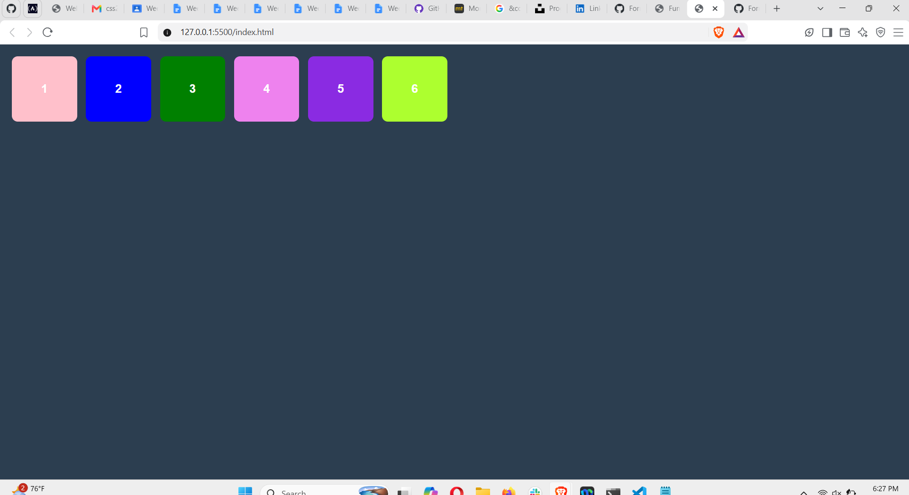
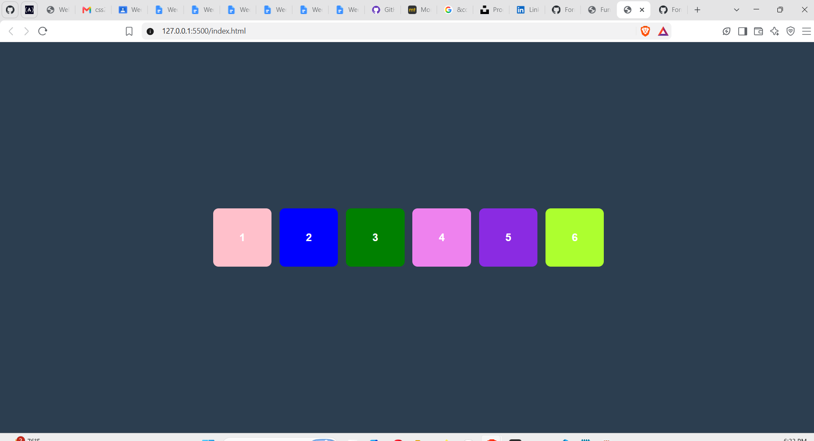
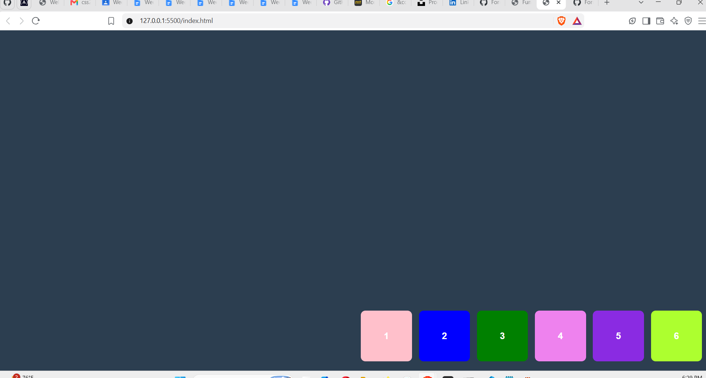

# Week 2 Flexbox Practice
**Student Name:** Ritha IRAGENA 
**Facilitator:** Derrick Mugisha  

## Project Description
This is my week 2 assignment. I used HTML and CSS to make a container that takes up the full screen height. 
There are 6 colored blocks inside that move to all 9 positions automatically using a CSS keyframe animation that runs on a loop. No JavaScript was used.

## Video Link
[Click here to watch my video presentation](https://drive.google.com/file/d/1xn3BD_aCKIfHdy71VcHwOOnZIpyoenzm/view?usp=sharing)

## Flexbox Properties Used
* display: flex - This changes the container to use flexbox layout.
* justify-content - This moves the blocks horizontally across the screen.
* align-items - This moves the blocks vertically up and down on the screen.
* flex-wrap - This allows the blocks to go to the next line when there is no space.
* gap - This adds space between each block.

## The 9 Positions Table

| Screen Position | justify-content | align-items |
| :--- | :--- | :--- |
| Top Left | flex-start | flex-start |
| Top Center | center | flex-start |
| Top Right | flex-end | flex-start |
| Middle Left | flex-start | center |
| Center | center | center |
| Middle Right | flex-end | center |
| Bottom Left | flex-start | flex-end |
| Bottom Center | center | flex-end |
| Bottom Right | flex-end | flex-end |

## Screenshots

### Top Left Layout

### Center Layout

### Bottom Right Layout

